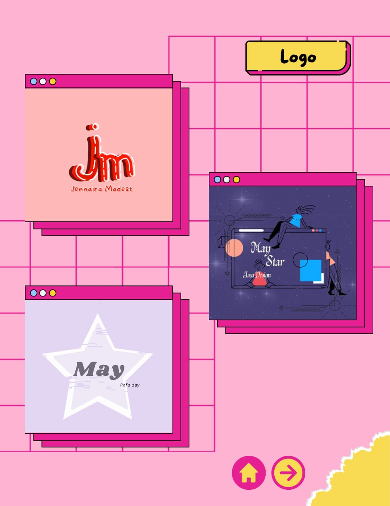
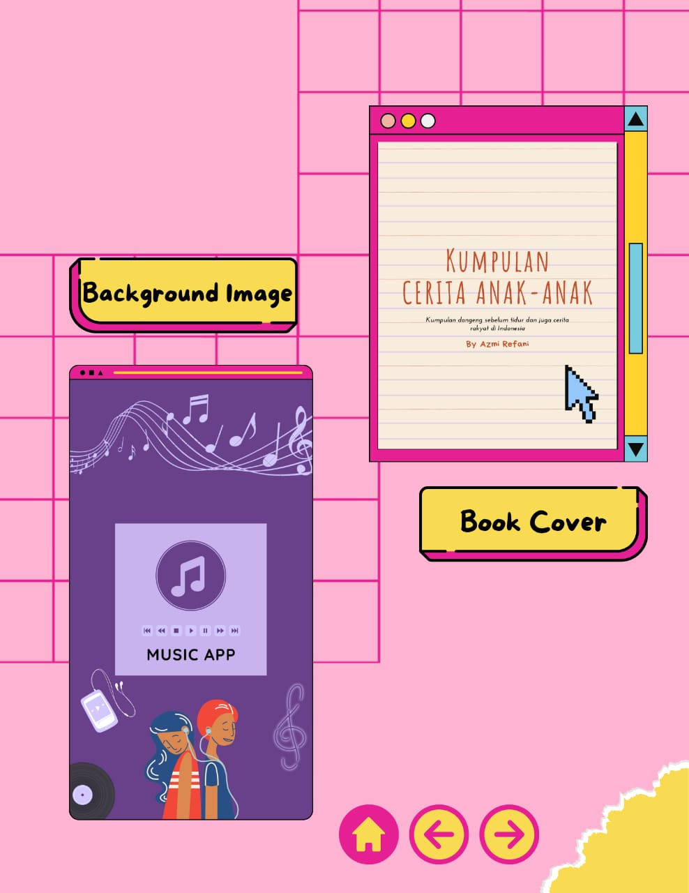
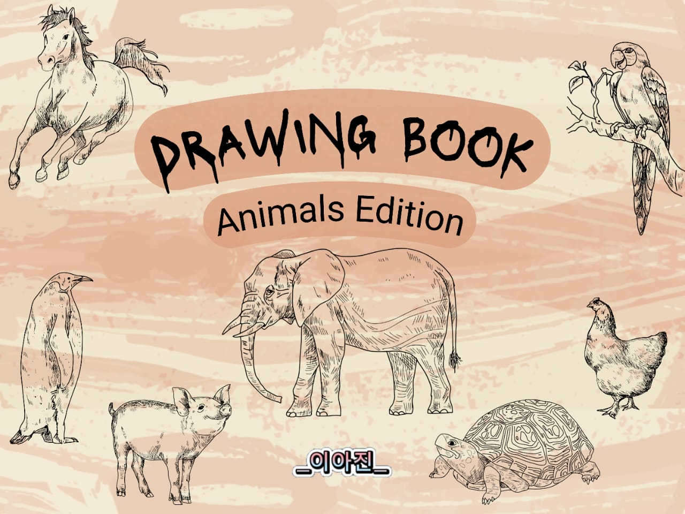
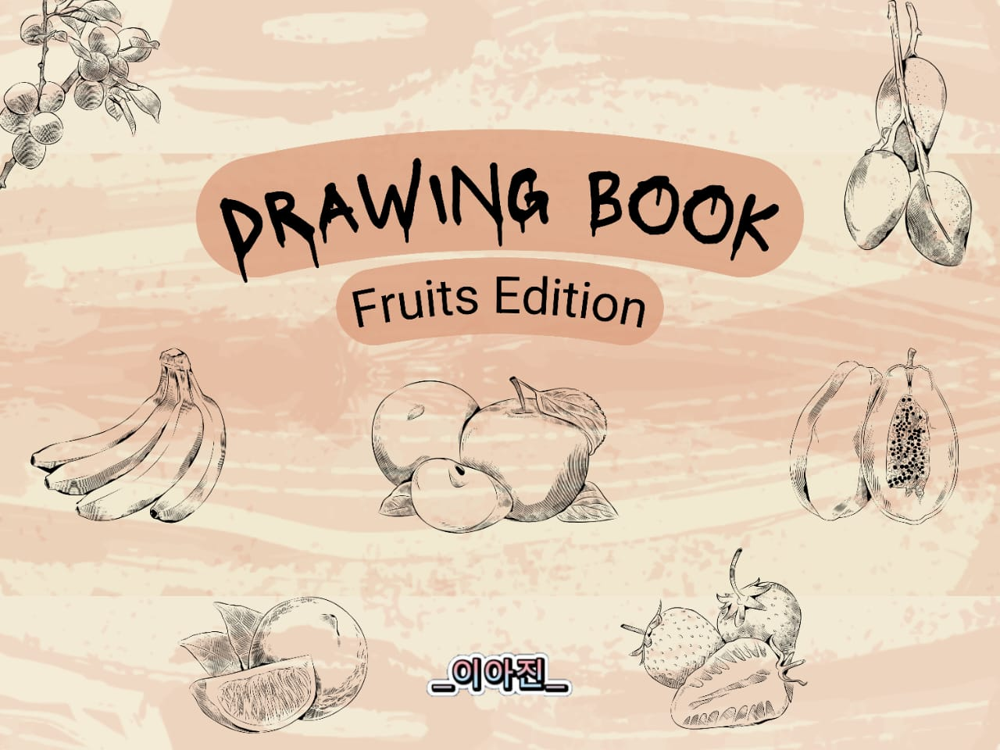
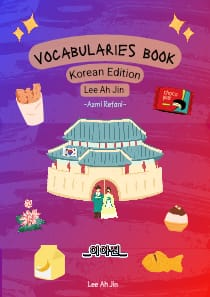
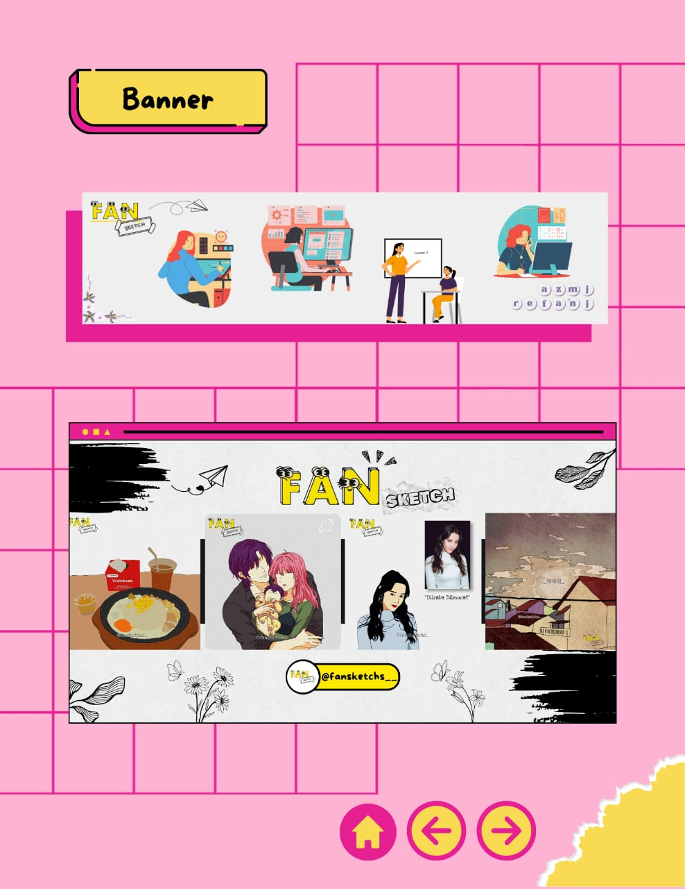
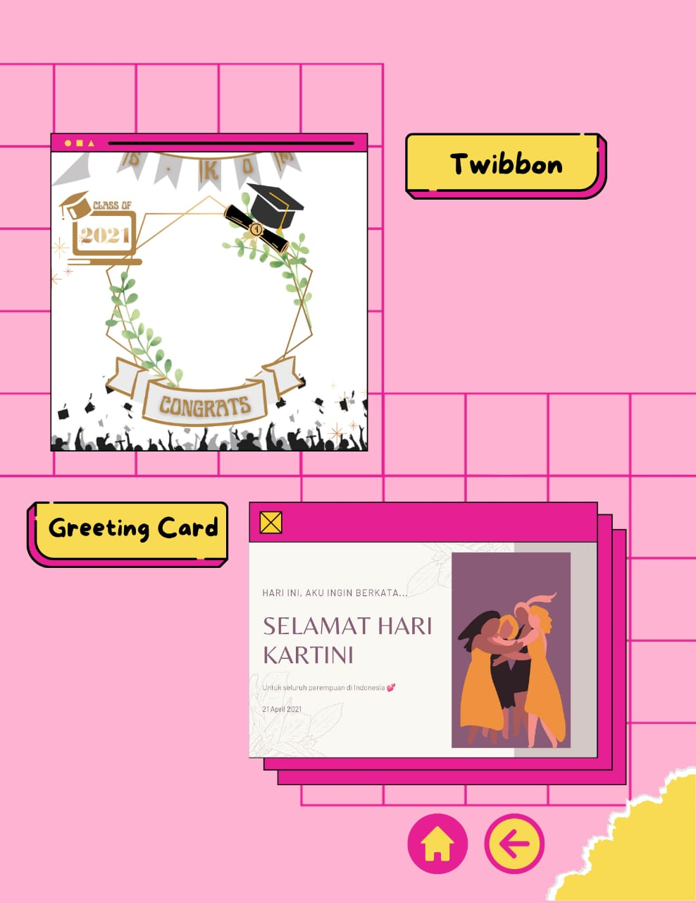

### Portfolios Non-IT

- Education : [Fan's Learning](https://azref12.github.io/fan-s-learning/)
- Promotional Videos : [@lee_ahjin](https://www.instagram.com/lee_ahjin/)
- Sketchs Commission : [@fansketchs__ ](https://www.instagram.com/fansketchs__/)
- Social Media Design : [@if16.iti](https://www.instagram.com/if16.iti/)
- Youtube Channel : [Ahjin Lee](https://www.youtube.com/@fansketchs/)
- Portfolio V1 : [Portfolio_V1](https://www.canva.com/design/DAGcDKUPUg4/C6_eoh6mYOJB27pmjWhhSw/edit?utm_content=DAGcDKUPUg4&utm_campaign=designshare&utm_medium=link2&utm_source=sharebutton)
- Portfolio V2 : [Portfolio_V2](https://www.canva.com/design/DAGPI1uZrXc/4ilQVwO84ULCnFVSY23HbQ/edit?utm_content=DAGPI1uZrXc&utm_campaign=designshare&utm_medium=link2&utm_source=sharebutton)

- Portfolio Details : 
#### 1. Logo

#### 2. Background Image & Book Cover
 
 
 

#### 3. Banner

#### 4. Twibbon & Greeting Card
